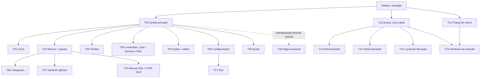

# SKald: mapa do sistema e das áreas de exploração

Data: 15/09/2026. Etapa: levantamento e planejamento; sem integração do mascote no aplicativo.

## 1. Conclusão e alcance da verificação

O SK MacroHelper é um aplicativo **Windows WPF/.NET 8**, com navegação interna por ViewModels. Não há rotas HTTP para as telas de trabalho. O Manual SQL é uma página HTML local hospedada em WebView2; isso permite inspecionar esse conteúdo em navegador, mas não transforma as demais telas em páginas web.

Este mapa identifica o que está declarado no **código atual do diretório de trabalho**, incluindo alterações locais anteriores. Foram lidos `CLAUDE.md`, `README.md`, views, ViewModels, componentes e code-behind. As instruções do usuário prevalecem sobre orientações anteriores de publicação e organização documental.

**Legenda de evidência:**

- **C — confirmado no código:** estrutura, controles, bindings ou fluxo local identificados. Não equivale a teste funcional aprovado.
- **V — verificado visualmente:** exige registro de execução/renderização com ambiente, dados e captura. As fichas deste inventário não atribuem V à interface WPF.
- **P — proposto:** zona, percurso ou integração do SKald ainda não implementados.
- **R — restrito:** superfície existente, excluída do catálogo comum do produto.

Todas as zonas abaixo são **P**, inclusive quando o elemento que lhes serve de referência é **C**. Não foram medidos coordenadas, área útil final dos sprites, oclusões, DPI ou colisões na aplicação em execução. Uma margem declarada em XAML não comprova que cabe um personagem. O relatório de execução/inspeção complementar deve ser consultado para evidências obtidas fora desta análise estática.

No [catálogo inicial](SKald-catalogo-de-cenas.md), a exploração ocorre na janela principal. Candidatos mencionados para busca, janelas flutuantes, diálogos e interior do Manual SQL são oportunidades de avaliação posterior, fora desse conjunto inicial; a orientação atual nessas superfícies é suspender. Não se propõem travessias entre janelas nem exploração do desktop.

As referências indicam arquivo e linha do levantamento. Como há alterações locais anteriores, as linhas podem mudar. Os nomes dos controles, comandos e propriedades são a referência mais durável.

## 2. Arquitetura da navegação

| Superfície | Implementação atual e evidência |
|---|---|
| Janela principal | `MainWindow`; barra lateral, cabeçalho e `ContentControl` ligado a `CurrentView`: [MainWindow.xaml](../MacroHelper.UI/Views/MainWindow.xaml), linhas 192, 666 e 732. |
| Navegação de trabalho | `PaginaAtiva` e comandos `NavigarPara...`: [MainViewModel.cs](../MacroHelper.UI/ViewModels/MainViewModel.cs), linhas 92–142. Chaves: `dashboard`, `macros`, `categorias`, `variaveis`, `manualsql`, `tarefas`, `compromissos`, `notas`, `ajuda`, `configuracoes`. São identificadores internos, não URLs. |
| Submenu Macros | Todas as macros, Categorias, Variáveis globais, Manual SQL MAX; expansão própria da barra lateral: [MainWindow.xaml](../MacroHelper.UI/Views/MainWindow.xaml), linhas 462–548. |
| Menu do usuário | Configurações, Ajuda e Sair, aberto por `AvatarToggle`: [MainWindow.xaml](../MacroHelper.UI/Views/MainWindow.xaml), linhas 277–371. |
| Janelas rápidas | Busca rápida, popup de macros e janelas laterais independentes; não passam pelo `ContentControl`. [BuscadorRapidoWindow.xaml.cs](../MacroHelper.UI/Views/BuscadorRapidoWindow.xaml.cs), linhas 780–915. |
| Diálogo de inserção | `VariaveisWindow` é aberto com `ShowDialog()` pelo serviço registrado na inicialização: [App.xaml.cs](../MacroHelper.UI/App.xaml.cs), linhas 223–224. |
| Bandeja/notificações | Menu Windows Forms para abrir janela, busca, pausar/retomar monitoramento e sair. Toasts de lembrete abrem a tarefa ou a tela correspondente. [TrayService.cs](../MacroHelper.UI/Windows/TrayService.cs), linha 94; [MainWindow.xaml.cs](../MacroHelper.UI/Views/MainWindow.xaml.cs), linhas 151–243. |

As setas sob Macros representam o agrupamento de navegação, não dependência da tela de listagem estar aberta. Atalhos podem ser personalizados; não usar as combinações padrão como identificadores de estado.

## 3. Contrato espacial proposto

### 3.1 Tipos de zona reutilizados nas fichas

O identificador completo combina tela e zona, por exemplo `T01.Z03`. Os tipos definem oportunidades, não áreas automaticamente liberadas.

| Zona | Área candidata | Ações possíveis se houver folga real | Critério de veto |
|---|---|---|---|
| Z01 | Faixa inferior interna, fora do conteúdo e dos controles | Caminhar, correr em trecho longo, parar, sentar, deitar | Rodapé, mensagens, resize, barra horizontal, texto ou corpo/capa fora da janela. |
| Z02 | Margem lateral interna livre | Entrada, saída, caminhada curta, observar | Barra lateral navegável, scrollbar, área de arraste, janela adjacente. |
| Z03 | Borda decorativa externa de cartão/painel | Subir por salto curto, sentar, ler, pensar, deitar | Se corpo/capa/livro cobrir título, dado, ação ou linha; borda fina não é plataforma validada. |
| Z04 | Vizinhança externa de botão ou ícone | Observar, inclinar, apontar, apoiar mão sem tocar no alvo real | Pointer próximo, foco, tooltip/menu, ação crítica, aparência de pressionado ou área clicável coberta. |
| Z05 | Espaço excedente de estado vazio já carregado | Vinheta com mesa, leitura, pensamento, caminhada curta | Mensagem/CTA ocupam a área; busca ativa; coleção temporariamente vazia durante carga. |
| Z06 | Nicho livre no cabeçalho de conteúdo | Saudação, pensamento, olhar para título, gesto breve | Cabeçalho de janela arrastável, título extenso, navegação e controles de janela. |
| Z07 | Vão entre cartões não interativo | Travessia e pequeno salto com aterrissagem validada | Vão menor que sprite completo e folga; animação de entrada; reflow, scroll ou cartões interativos. |

### 3.2 Regras de bloqueio e leitura

1. **Área branca não é área segura.** A grade semanal possui botões em horários vazios; a grade mensal usa dias clicáveis. Cartões de notas também são acionáveis. Excluir a área interativa inteira do cálculo.
2. Medir o envelope de **todos os quadros da ação**, incluindo capa, elmo, livro, partículas e sombra. O pé serve de âncora, mas o resto do sprite precisa caber.
3. Colisão inclui texto e informação passiva, além de botões: título, conteúdo da nota, SQL, prazo, contadores, badges, mensagens e prévia são áreas de leitura protegidas.
4. Considerar `Popup`, `ContextMenu`, tooltip, combo aberto, calendário e barra de seleção como obstáculos de maior prioridade. Popups WPF podem estar fora da árvore visual da view.
5. Suspender novas cenas durante digitação, seleção de texto, captura de atalho, rolagem, arraste e redimensionamento. Recalcular quando o layout estabilizar.
6. Ao abrir formulário/modal, encerrar a exploração da tela ao fundo. Uma animação decorativa em nicho do formulário só poderá existir após medição específica; a opção inicial recomendada é suspensão.
7. Não simular `Click`, `Execute`, `Invoke`, tecla, foco, hover programático, mudança de `IsPressed` ou entrada de acessibilidade nos controles reais. O gesto pertence apenas ao desenho do personagem.
8. Na proposta de implementação, o host decorativo não participa do hit-test nem da navegação de teclado. Preferências explícitas de SKald devem ficar em controles normais e separados, ainda não existentes.
9. Se o percurso deixar de ser válido, parar em quadro neutro e sair/esmaecer em área segura. Não atravessar um modal para terminar uma animação.
10. Manter uma única presença visual global, com um hospedeiro da aplicação. No conjunto inicial, esse hospedeiro é a janela principal; suspender em janelas auxiliares. Ao ocultar na bandeja, perder visibilidade ou sair da janela do produto, suspender. Não atravessar entre janelas nem cruzar outros aplicativos.

## 4. Inventário de telas, componentes e estados

### T00 — Casca da janela principal

- **C / acesso:** janela principal; estados normal, maximizada, minimizada/oculta na bandeja; página ativa; grupo Macros expandido/recolhido; menu do usuário aberto/fechado; monitoramento ativo/pausado e mensagem de status.
- **Componentes:** sidebar de coluna 250, logo, status do hook, avatar/menu, navegação rolável, cabeçalho de 52, busca, minimizar, maximizar/restaurar, fechar, área `CurrentView`. Evidência: [MainWindow.xaml](../MacroHelper.UI/Views/MainWindow.xaml), linhas 192–198, 246–277, 384, 666–732; [MainWindow.xaml.cs](../MacroHelper.UI/Views/MainWindow.xaml.cs), linhas 390–522.
- **P / locais:** `T00.Z01` somente se houver margem inferior interna realmente vazia; `T00.Z02` em margem externa do painel de conteúdo, jamais sobre itens da sidebar; `T00.Z06` apenas nicho não arrastável/não textual identificado em execução.
- **Veto:** logo e cabeçalho não são automaticamente poleiros; a janela muda cantos/limites ao maximizar; submenu altera ocupação vertical. Botões de fechar/minimizar/sair excluídos de brincadeiras.
- **Pendente V:** tamanhos mínimo e normal, maximizada, menu aberto, navegação longa, tema claro/escuro, DPI e monitores.

### T01 — Início / Dashboard

- **C / estados:** saudação/data; métricas de macros cadastradas, usos hoje e tempo economizado; badge de macros novas na semana; ranking mensal vazio/preenchido; tarefas de hoje/atrasadas vazias/preenchidas com prioridade alta, prazo e lembrete; contagem de tarefas fora do corte; cartão de compromissos do dia visível somente quando existem itens.
- **Componentes/ações:** hero com Nova macro; três cartões numéricos; compromissos de hoje + Ver todos; Macros mais usadas; Hoje e atrasadas + Ver todas; checkbox de concluir tarefa.
- **Evidência:** [DashboardView.xaml](../MacroHelper.UI/Views/DashboardView.xaml), linhas 75–109, 139–212, 268–328, 344–451; [DashboardViewModel.cs](../MacroHelper.UI/ViewModels/DashboardViewModel.cs), linhas 20, 39–51, 81–144.
- **P / locais:** `T01.Z03` beirada livre dos cartões numéricos para ler/pensar; `T01.Z07` vãos entre métricas para caminhada/salto curto; `T01.Z05` folga dos estados vazios de ranking ou tarefas; `T01.Z04` vizinhança livre de Nova macro para curiosidade visual; `T01.Z01` percurso inferior se cartão de compromissos/reflow não o ocupar.
- **Veto:** números, contadores, prazos e checkbox não podem ficar atrás do sprite. Não interpretar ranking vazio como inexistência de macros, nem tarefas do dia vazias como ausência de tarefas. Concluir tarefa reorganiza a lista.
- **Pendente V:** combinações de cartões ocultos, zero dados, seis tarefas e excedentes, títulos longos e ranking cheio.

### T02 — Macros e T02.F — gaveta de criação/edição

- **C / lista:** busca textual, categoria, favoritos, arquivadas; carregamento; resultados/nenhum resultado; macro ativa/inativa, com categoria/favorito; cópia, editar, menu de mais ações; mensagens.
- **C / formulário:** gaveta à direita de largura 520 com overlay; novo/edição; atalho e título, categoria, conteúdo multilinha com números de linha; buscar/substituir oculto/aberto; tokens detectados; atalho de teclado; imagem presente/ausente; ativa/inativa; erro de validação, aviso de duplicata; salvar/cancelar; histórico aberto, vazio ou preenchido; restaurar versão.
- **C / transientes:** menu Mais: duplicar, enviar por e-mail, arquivar/restaurar, excluir. Importar JSON/CSV e exportar JSON abrem diálogos nativos de arquivo. Não assumir confirmação de exclusão onde não existe no fluxo.
- **Evidência:** [MacrosView.xaml](../MacroHelper.UI/Views/MacrosView.xaml), linhas 43–69, 92–191, 198–439, 487–667, 768–856; [MacrosView.xaml.cs](../MacroHelper.UI/Views/MacrosView.xaml.cs), linhas 188–226; [MacrosViewModel.cs](../MacroHelper.UI/ViewModels/MacrosViewModel.cs), linhas 44–59, 93–131, 188–201.
- **P / locais:** `T02.Z01/Z02` margens externas da lista; `T02.Z03` beirada livre de cartão de macro sem tocar título/resumo/badges; `T02.Z05` folga junto ao estado vazio; `T02.Z04` vizinhança externa de Nova Macro ou favorito, somente em repouso; `T02.F.Z03` borda externa da gaveta condicionada à inspeção, com exploração ao fundo suspensa.
- **Veto:** texto da macro, tokens, numeração, seleção, imagem e painel de busca/substituição são protegidos. Menus alteram a área útil e podem sair da janela. Arquivar/excluir/importar/exportar/enviar são ações funcionais: nenhuma cena as aciona ou sugere sucesso antes do resultado.
- **Pendente V:** filtros combinados, cartão extenso, imagem, histórico, validação/duplicata, campos focados e diálogos nativos.

### T03 — Tarefas e T03.F — formulário

- **C / lista:** chips Abertas, Hoje, Atrasadas e Concluídas com contadores; lista vazia por filtro; prioridade baixa/normal/alta; recorrência, observação, prazo, lembrete; checkbox de concluir/reabrir; editar; excluir com confirmação inline; mensagem de resultado.
- **C / formulário:** nova/edição; título obrigatório, observações, três prioridades, recorrência, prazo, atalhos Hoje/Amanhã, data/hora do lembrete, atalhos Em 1h/Amanhã 9h, remover lembrete, calendário, salvar/cancelar e erro de título/data/hora.
- **Evidência:** [TarefasView.xaml](../MacroHelper.UI/Views/TarefasView.xaml), linhas 28–184, 225–296, 318–471; [TarefasViewModel.cs](../MacroHelper.UI/ViewModels/TarefasViewModel.cs), linhas 16–38, 67–87, 198–249.
- **P / locais:** `T03.Z01/Z02` perímetro livre da lista; `T03.Z03` borda livre de cartão em repouso; `T03.Z05` vazio do filtro para pensar/descansar sem encobrir instrução; `T03.Z04` olhar para Nova Tarefa; `T03.F.Z03` apenas nicho exterior se comprovado.
- **Veto:** checkbox conclui e pode gerar recorrência; prazo atrasado e prioridade são informação prioritária. Confirmação de exclusão expande a linha; filtros mudam conteúdo e geometria. “Concluídas vazio” não significa trabalho encerrado.
- **Pendente V:** todos filtros, tarefas recorrentes, prazo/lembrete independentes, atraso, erro e confirmação inline.

### T04 — Lembretes: T04.L Lista, T04.S Semana, T04.M Mês e T04.F formulário

- **C / navegação:** Lista/Semana/Mês; setas de período e Hoje nas grades; modo persistido; título de período. Lista: Próximos, Hoje, 7 dias, Histórico; vazio por filtro; agendado/sem data, realizado/cancelado; local, observações, avisos; realizar, cancelar, voltar para agenda, editar/excluir e confirmação inline.
- **C / semana:** cabeçalho de dias clicável; linhas/horários; slots clicáveis de meia hora; blocos com horário e título; sobreposição visual de compromissos e indicador de choque; faixa de horas ajustada aos dados; rolagem; tarja Sem data marcada com Ver na lista.
- **C / mês:** células de dias clicáveis; realce de hoje/período; etiquetas de compromissos; choque de horário; contador de itens excedentes. O espaço sem evento dentro do dia continua sendo parte do botão do dia.
- **C / formulário:** título obrigatório, local, data/hora, duração, aviso antecipado e em cima da hora, observações, atalhos/presets, calendário, salvar/cancelar, validação. Sem data é aceito no código, embora o rótulo QUANDO mantenha asterisco; sem data não há aviso.
- **Evidência:** [CompromissosView.xaml](../MacroHelper.UI/Views/CompromissosView.xaml), linhas 55–326, 384–527, 669–750; [AgendaCalendarioView.xaml](../MacroHelper.UI/Views/AgendaCalendarioView.xaml), linhas 45–67, 87–147, 203–319, 333–463; [CompromissosViewModel.cs](../MacroHelper.UI/ViewModels/CompromissosViewModel.cs), linhas 36–78, 149–176, 492–551.
- **P / locais Lista:** `T04.L.Z01/Z02` margem livre; `T04.L.Z03` beirada livre dos cartões; `T04.L.Z05` vazio já filtrado; `T04.L.Z04` observar Novo lembrete.
- **P / locais grades:** `T04.S.Z02` e `T04.M.Z02` apenas perímetro **externo** da grade; `T04.S.Z06/T04.M.Z06` nicho externo à navegação do período para ler/consultar livro; `T04.S.Z03/T04.M.Z03` borda decorativa do painel completo, se houver espaço para o corpo. O mascote pode olhar para dias/choques à distância.
- **Veto:** nenhuma caminhada pelas células nem salto sobre blocos; calendário é área funcional densa. Não “organizar”, arrastar ou corrigir compromissos visualmente; não há recurso atual de arrastar para remarcar. Choques e avisos precisam continuar legíveis.
- **Pendente V:** todos modos/filtros; semana sem dados, dia com sobreposição, horários extremos, mês com excedentes, lembretes sem data, realizados/cancelados, popup de calendário e erro de data/hora.

### T05 — Notas e T05.F — editor

- **C / lista:** pesquisa com debounce; notas fixadas/não fixadas; cartões com título, resumo, data, copiar, fixar, abrir e excluir; confirmação inline; mensagem de cópia/salvamento/erro; vazio compartilha instrução “Crie uma nota ou limpe a busca”.
- **C / editor:** overlay; título opcional; escrever/ver; fixar; `RichTextBox` e conteúdo formatado; barra fixa; barra contextual ao selecionar; popups de link e caracteres especiais; prévia de leitura rolável; salvar/cancelar/fechar; erro. Título vazio usa conteúdo conforme regra do serviço, não deve ser tratado pelo mascote como erro por si só.
- **Evidência:** [NotasView.xaml](../MacroHelper.UI/Views/NotasView.xaml), linhas 24–164, 211–246, 263–379; [NotasViewModel.cs](../MacroHelper.UI/ViewModels/NotasViewModel.cs), linhas 15–36, 64–125; [BarraDeMarcacao.xaml](../MacroHelper.UI/Controls/BarraDeMarcacao.xaml), linhas 104–139; [BarraAoSelecionar.cs](../MacroHelper.UI/Helpers/BarraAoSelecionar.cs), linhas 77–110.
- **P / locais:** `T05.Z01/Z02` margens livres da coleção; `T05.Z05` área excedente fora da mensagem de vazio, especialmente para vinheta de mesa; `T05.Z03` beirada **externa** ao cartão acionável; `T05.Z04` olhar para Nova Nota. Leitura do SKald em `T05.F` apenas em nicho comprovado no modo Ver e após pausa; por padrão suspender durante editor.
- **Veto:** nunca usar `Notas.Count == 0` isoladamente para “primeira nota”. Separar ausência real no banco, busca sem resultados, carregamento e falha. Seleção e popups têm prioridade. Cartão inteiro abre a nota; não é piso.
- **Pendente V:** busca vazia e sem resultado, primeira nota real, nota extensa, Markdown legado, seleção/link/Ω, leitura, fixação e erro.

### T06 — Categorias e T06.F — formulário

- **C / estados:** lista de raízes e subcategorias, ícone/cor/nome/contagem; vazio; novo/editar; nome obrigatório, seletor de ícones, cor hexadecimal, pai opcional; validação; exclusão inline informa uso em macros; mensagens.
- **Evidência:** [CategoriasView.xaml](../MacroHelper.UI/Views/CategoriasView.xaml), linhas 42–155, 174–220, 243–332, 364–435; [CategoriasViewModel.cs](../MacroHelper.UI/ViewModels/CategoriasViewModel.cs), linhas 13–31, 75–105.
- **P / locais:** `T06.Z03` beirada externa dos grupos; `T06.Z07` vão entre grupos para andar/salto se a hierarquia não o ocupar; `T06.Z05` vazio; `T06.Z04` observar ícone de categoria à distância. Pensar/ler pode usar nicho lateral, sem ler dados pessoais em balões.
- **Veto:** hierarquia/ramificações e nomes são informação, não escadas automáticas. Subcategoria muda altura; exclusão abre confirmação. Há tooltip textual de “sem permissão” no botão Nova Categoria, porém esta cópia é local e não estabelece um fluxo de perfis de acesso; não inventar cena de acesso negado a partir dele.
- **Pendente V:** raiz/subcategoria, nomes extensos, muitas categorias, pai, ícones/cor, duplicata e uso em macros.

### T07 — Variáveis globais e T07.F — formulário

- **C / estados:** lista/vazio; nome/token, valor padrão e descrição; criar/editar/excluir; confirmação informa quantas macros usam a variável; formulário com nome, valor padrão e descrição; erro e sucesso.
- **Evidência:** [VariaveisGlobaisView.xaml](../MacroHelper.UI/Views/VariaveisGlobaisView.xaml); [VariaveisGlobaisViewModel.cs](../MacroHelper.UI/ViewModels/VariaveisGlobaisViewModel.cs), linhas 13–24, 36–77.
- **P / locais:** `T07.Z01/Z02` percurso no perímetro; `T07.Z03` borda externa de painel; `T07.Z05` vinheta vazia; `T07.Z04` observar Nova Variável ou token decorativo à distância. Gestos de estudo e conjuração breve são coerentes após ação confirmada.
- **Veto:** valores podem conter dados de trabalho; não replicar no sprite, balão ou registro. Não agir sobre tokens reais; não inferir que um valor vazio seja sempre erro. Formulário/combos/confirmações suspendem percurso.
- **Pendente V:** cadastro vazio, nomes longos, variáveis em uso, erro de validação e exclusão.

### T08 — Configurações

- **C / seções:** Aparência (Sistema/Claro/Escuro); Personalização (cores de destaque e rever tour); Gatilho e Digitação (prefixo, apps de fallback, sugestão proativa, histórico de clipboard, Salvar); Comportamento (nome, iniciar com Windows, minimizar para bandeja, testar notificação); Atalhos de Teclado (captura de busca/repetição, restaurar padrão); Saúde do App (memória, versão, macros, CPU, memória do computador, disco e atualizar); Salvar configurações.
- **C / estados:** opção ativa, cor selecionada, switches, captura de atalho em andamento, dados de saúde presentes/ausentes e mensagem de resultado. Não existem controles de SKald nesta tela ainda.
- **Evidência:** [ConfiguracoesView.xaml](../MacroHelper.UI/Views/ConfiguracoesView.xaml), linhas 42–179, 183–268, 283–331, 344–407, 421–514, 529–606.
- **P / locais:** `T08.Z03` beiradas externas dos painéis para sentar/pensar; `T08.Z07` intervalo entre seções para caminhar; `T08.Z04` observar amostra de cor em repouso, fora das opções. Reação à troca de tema só após aplicação real, sem alterar preferência.
- **Veto:** captura de tecla suspende tudo; teste de notificação, inicialização Windows e restauração são funções reais; nenhum gesto as aciona. Rolagem e mudança de mensagem alteram o mapa. Nunca desenhar por cima de valores de saúde ou rótulos.
- **Pendente V:** todos temas/cores, captura/cancelamento/conflito de atalho, scroll, resultado de salvar e saúde indisponível.

### T09 — Ajuda

- **C / estados/componentes:** perguntas em acordeões abertos/fechados; resposta; painel Atalhos úteis; Abrir chamado; identificação do produto/versão. A faixa “Buscar na ajuda” é apenas `Border`/`TextBlock`, sem caixa de entrada, binding de busca ou filtro implementado. Sem fluxo de conversa com o SKald ou suporte automatizado implementado.
- **Evidência:** [AjudaView.xaml](../MacroHelper.UI/Views/AjudaView.xaml), linhas 21–22, 42–101, 117–213; [AjudaViewModel.cs](../MacroHelper.UI/ViewModels/AjudaViewModel.cs).
- **P / locais:** `T09.Z03` beirada exterior do painel de atalhos para ler; `T09.Z07` vão entre FAQ e painel lateral; `T09.Z02` margem livre; `T09.Z04` gesto de orientação para pergunta já visível sem abrir acordeão.
- **Veto:** expansão de resposta altera altura; textos e atalhos não podem ser cobertos; botão Abrir chamado é ação externa e não integra a brincadeira. Não planejar cenas de resultado de busca de ajuda inexistente.
- **Pendente V:** respostas longas, várias abertas, tamanho estreito e rolagem. Busca funcional permanece fora da implementação atual.

### T10 — Manual SQL MAX

- **C / host:** WebView2 ocupa a view. Carrega `Resources/manual_sql_max.html`; se o arquivo não existir, exibe aviso e caminho esperado. [ManualSqlView.xaml](../MacroHelper.UI/Views/ManualSqlView.xaml), linhas 19–34; [ManualSqlView.xaml.cs](../MacroHelper.UI/Views/ManualSqlView.xaml.cs), linhas 14–31.
- **C / HTML:** campo de busca e contador; quatro abas: **Consultas**, **Dicionário de tabelas**, **Relacionamentos**, **Padrões e armadilhas**. Consultas/tabelas têm chips por módulo, filtro e vazio. Consultas possuem fichas, objetivo, metadados, código SQL, notas e botão Copiar; feedback Copiado ou Selecione manualmente. Dicionário tem descrição, campos e relações. Relações e padrões são painéis de leitura; busca/chips não filtram esses dois painéis como filtram consultas/tabelas.
- **Evidência:** [manual_sql_max.html](../MacroHelper.UI/Resources/manual_sql_max.html), linhas 406–423, 485, 1257–1264, 1300–1309, 1333–1394. IDs reais: `busca`, `contador`, `chips`, `painel-consultas`, `painel-tabelas`, `painel-relacionamentos`, `painel-padroes`.
- **P / locais iniciais:** somente `T00` fora do WebView2. `T10.Z02` margem da página, `T10.Z03` lombada externa livre de ficha e `T10.Z07` intervalo entre fichas são **hipóteses de uma fase própria**, condicionadas a inspeção DOM, coordenação de scroll e composição WPF/WebView2.
- **Veto:** não andar sobre SQL, tabelas, relacionamentos, notas de uso, botões Copiar ou campos. Não executar SQL nem alterar clipboard para validar cenas. Não assumir que captura de HTML no navegador valida sobreposição WPF/WebView2.
- **Pendente V neste inventário:** host nativo, arquivo ausente e falha de runtime WebView2. A inspeção da página isolada pode ser registrada separadamente, sem promover o host a validado.

### T11 — Busca rápida: cinco abas

- **C / acesso:** atalho global padrão Ctrl+Espaço, botão de busca no cabeçalho ou bandeja. Abre em Macros. Janela de largura 568 e altura por conteúdo; posicionamento depende do monitor/área de trabalho. Busca, lista selecionável, prévia, dicas de teclado, contagem, LinhaDeEstado, vazio e erro/feedback.
- **Evidência:** [BuscadorRapidoWindow.xaml](../MacroHelper.UI/Views/BuscadorRapidoWindow.xaml), linhas 7, 151–233, 700–830; [BuscadorRapidoWindow.xaml.cs](../MacroHelper.UI/Views/BuscadorRapidoWindow.xaml.cs), linhas 19, 85–119, 192–237, 279–357, 573–676.

| Subtela | Componentes e estados C | Risco/interação real |
|---|---|---|
| T11.M Macros | Título, conteúdo, atalho, favorito, seleção, prévia com linhas/tokens, nenhuma macro/sem resultado | Enter insere; favorito modifica registro. |
| T11.T Tarefas | Título, prazo, lembrete, observações, prioridade, concluída; Criar; editar F2; prévia | Enter conclui/reabre; lateral T14; resultados mudam. |
| T11.L Lembretes | Horário/data, título, local, avisos, cancelado; Criar; editar F2; prévia | Enter altera realização; lateral T15. |
| T11.N Notas | Título, resumo, fixação, data; Criar; prévia | Enter abre lateral T13; Ctrl+Enter insere texto no app de origem. |
| T11.C Copiados | Resumo, data, tamanho, origem, pin, remover, Limpar; captura desligada/lista vazia/busca sem resultado | Inserção envia texto; fixar/remover/limpar escrevem dados. |

- **P / locais:** `T11.Z05` nicho do vazio após estabilizar e somente fora da mensagem; `T11.Z02` margem interna comprovada; `T11.Z03` beirada exterior do painel de prévia, se existir folga. Preferência de projeto: cenas muito breves ou presença suspensa em busca ativa, pois a janela é compacta e orientada ao teclado.
- **Veto:** não usar rodapé de dicas, abas, prévia ou lista como pista; digitação, Tab, setas, mudança de seleção e abertura da lateral invalidam o mapa. Não atribuir à busca as quatro abas descritas no README antigo; o enum atual possui cinco.
- **Pendente V:** cinco abas com/sem dados e sem resultado, captura desligada, prévia extensa, criação/exclusão, navegação teclado, dupla janela e monitores.

### T12 — Popup de sugestão de macros

- **C / acesso/estados:** digitar prefixo+atalho; popup Topmost com tamanho pelo conteúdo; gatilho, lista, título/resumo/atalho, item selecionado; dicas de setas/Enter/Esc; posição próxima ao contexto de digitação. [MacroPopupWindow.xaml](../MacroHelper.UI/Views/MacroPopupWindow.xaml), linhas 6, 24–39, 52–61 e 113–125; [MacroPopupWindow.xaml.cs](../MacroHelper.UI/Views/MacroPopupWindow.xaml.cs).
- **P / local:** sem zona liberada inicialmente. Uma reação mínima futura exigiria nicho interno medido; a busca rápida é ambiente mais apropriado para exploração opcional.
- **Veto:** aparece durante trabalho em outro aplicativo; não ocupar campo de origem, não roubar foco, não atrasar inserção, não passear pelo desktop. Seleção é prioritária e o fechamento pode ser imediato.
- **Pendente V:** posição em bordas/monitores, lista curta/longa, seleção, fechamento e comportamento de foco.

### T13 — Nota flutuante

- **C / componentes/estados:** janela lateral de largura 640; título editável, ver/escrever, fechar, barra de marcação, RichTextBox, prévia rolável; Apagar com segundo clique, LinhaDeEstado, Inserir no app, Salvar; nova/existente, conteúdo alterado/inalterado, troca de nota. A seleção no buscador atualiza a nota lateral aberta.
- **Evidência:** [NotaFlutuanteWindow.xaml](../MacroHelper.UI/Views/NotaFlutuanteWindow.xaml), linhas 6, 109–153, 180–228; [NotaFlutuanteWindow.xaml.cs](../MacroHelper.UI/Views/NotaFlutuanteWindow.xaml.cs); [BuscadorRapidoWindow.xaml.cs](../MacroHelper.UI/Views/BuscadorRapidoWindow.xaml.cs), linhas 64–75, 891–903.
- **P / locais:** `T13.Z03` beirada exterior em modo leitura, somente após medir; `T13.Z02` nicho interno livre, sem atravessar para o desktop; livro e pensamento breves. Nenhuma pista de corrida presumida nesta janela.
- **Veto:** título/corpo são campos; rodapé é de estado/ações; fechar/perder foco/trocar item participam do salvamento da nota. Não criar uma presença duplicada com T11 nem tratar margem entre janelas como ponte automaticamente segura.
- **Pendente V:** texto grande, autogravação, erro, modo leitura, editor/seleção/popups, posicionamento em par e monitor menor.

### T14 — Tarefa flutuante

- **C / componentes/estados:** largura 470; concluir/reabrir, título, observações, prioridade, repetição, prazo, data/hora de lembrete, calendários; adiar 15 min/1 hora/amanhã; apagar com confirmação, estado e salvar. Acessível pelo buscador e pelo lembrete da tarefa.
- **Evidência:** [TarefaFlutuanteWindow.xaml](../MacroHelper.UI/Views/TarefaFlutuanteWindow.xaml), linhas 6, 147–182, 204–269, 294–322; [MainWindow.xaml.cs](../MacroHelper.UI/Views/MainWindow.xaml.cs), linhas 171–187.
- **P / locais:** somente `T14.Z02/Z03` nichos externos medidos; pensamento/repouso curto depois de leitura e sem foco em campo; exploração inicialmente suspensa.
- **Veto:** janela compacta; adiar e checkbox alteram regras/dados; toda mudança de estado/mensagem pode mexer na altura. Calendários/combo e captura de texto suspendem animação.
- **Pendente V:** nova/existente, concluída, recorrência, aviso adiado, erros de data, salvar e confirmação.

### T15 — Lembrete flutuante

- **C / componentes/estados:** largura 470; feito/voltar para lista; título, data/hora, local, combos de avisos antecipados/na hora, observações, apagar, estado, salvar; novo/existente, sem data/com data, erro. Não assume equivalência de todos campos com o formulário T04.F: a versão flutuante não expõe o mesmo conjunto de presets/duração.
- **Evidência:** [CompromissoFlutuanteWindow.xaml](../MacroHelper.UI/Views/CompromissoFlutuanteWindow.xaml), linhas 6, 106–141, 166–229, 248–256; [CompromissoFlutuanteWindow.xaml.cs](../MacroHelper.UI/Views/CompromissoFlutuanteWindow.xaml.cs).
- **P / locais:** `T15.Z02/Z03` apenas nicho comprovado para observar/pensar; por padrão suspensão durante preenchimento.
- **Veto:** combos abertos, calendário, campos, avisos, salvar/apagar/feito; nenhuma interação visual deve aparentar alterar hora ou confirmar compromisso.
- **Pendente V:** sem data, combos/presets, validação, realizado, edição/troca de seleção e janela em par.

### T16 — Preencher Variáveis da inserção

- **C / estados/componentes:** janela modal Topmost de largura 440; campos dinâmicos TextBox ou ComboBox; token exato, rótulo e badge automático; valor padrão/preenchido; prévia; cancelar/fechar/inserir. Foco inicial vai ao primeiro campo que exige decisão. Conteúdo é devolvido à inserção só quando o diálogo confirma.
- **Evidência:** [VariaveisWindow.xaml](../MacroHelper.UI/Views/VariaveisWindow.xaml), linhas 4–8, 42–68; [VariaveisWindow.xaml.cs](../MacroHelper.UI/Views/VariaveisWindow.xaml.cs), linhas 26–67; [App.xaml.cs](../MacroHelper.UI/App.xaml.cs), linhas 223–224.
- **P / local:** sem exploração enquanto o diálogo pede valores. Eventual pose discreta exigiria espaço reservado aprovado e não integra a primeira implantação.
- **Veto:** fluxo de teclado, listas, valores possivelmente sensíveis e prévia são protegidos; nada de capturar/ecoar conteúdo da macro. Um gesto não pode equivaler a Enter nem sugerir sucesso de inserção antes do serviço confirmar.
- **Pendente V:** muitas variáveis, listas longas, automáticas, cancelamento, foco e limites de altura.

### T17 — Tour de boas-vindas

- **C / estados:** cinco passos: boas-vindas, gatilho por texto, busca rápida, tarefas/lembretes/notas e uso offline; ícone, título, descrição, indicador de passo, Pular, Próximo/Concluir. Reaberto pelas Configurações.
- **Evidência:** [TourWindow.xaml](../MacroHelper.UI/Views/TourWindow.xaml), linhas 4, 18–39; [TourWindow.xaml.cs](../MacroHelper.UI/Views/TourWindow.xaml.cs), linhas 21–36, 52–68.
- **P / local:** `T17.Z06` substituir futuramente a função decorativa do ícone por apresentação do mascote, ou nicho equivalente; isso é alteração de apresentação proposta, ainda não realizada. Sem exploração da tela ao fundo.
- **Veto:** não cobrir descrição/contador nem avançar passos automaticamente; respeitar Pular e fechamento imediato.
- **Pendente V:** cinco passos, altura variável, primeiro uso e revisão do tour, teclado e fechamento.

### T18 — Página pessoal restrita

- **C/R:** sobreposição pessoal existente em `MainWindow`, fora do mapa de navegação de produto. Oculta ao trocar de tela ou acionar a barra lateral. Possui conteúdo WebView2 e estados próprios de abertura/indisponibilidade. [MainWindow.xaml](../MacroHelper.UI/Views/MainWindow.xaml), linhas 772–773; [PaginaOcultaView.xaml.cs](../MacroHelper.UI/Views/PaginaOcultaView.xaml.cs).
- **P:** nenhuma cena de produto ou mapeamento de conteúdo pessoal. A futura coordenação global do mascote deve suspender sua presença quando essa sobreposição estiver visível.
- **Pendente:** verificação visual intencionalmente não realizada; não acessar contas, dados ou serviços pessoais para este planejamento. Exclusão dessa página dos pacotes é decisão existente no `CLAUDE.md`, não trabalho de empacotamento executado aqui.

## 5. Componentes e superfícies transientes compartilhados

| ID | Componente C | Impacto sobre o SKald P | Evidência |
|---|---|---|---|
| UI01 | `SeletorDeData`: entrada de data + botão + `PopupCalendario` | Suspender ao abrir; incluir popup completo, sombra e navegação dos dias como obstáculos | [SeletorDeData.xaml](../MacroHelper.UI/Controls/SeletorDeData.xaml), linha 42. |
| UI02 | `BarraDeMarcacao`: formatação, link e caracteres | Reservar barra fixa, flutuante e dois popups; pausar durante seleção/foco | [BarraDeMarcacao.xaml](../MacroHelper.UI/Controls/BarraDeMarcacao.xaml), linhas 104–139. |
| UI03 | `BarraAoSelecionar` cria popup separado | Não procurar obstáculos apenas nos filhos da view | [BarraAoSelecionar.cs](../MacroHelper.UI/Helpers/BarraAoSelecionar.cs), linhas 77–96. |
| UI04 | `ComboBox` e seu popup | Não pousar na borda aparente do combo nem ocultar opções | [App.xaml](../MacroHelper.UI/App.xaml), linhas 512–534. |
| UI05 | Tooltips e menus de contexto | Prioridade sobre ator; retirar/ocultar sem deslocar o tooltip | [App.xaml](../MacroHelper.UI/App.xaml), linha 1000; [MacrosView.xaml](../MacroHelper.UI/Views/MacrosView.xaml), linha 830. |
| UI06 | Mensagens de ViewModel e `LinhaDeEstado` | Não sobrepor feedback; sucesso exige retorno real, falha tem prioridade e não gera celebração | [ViewModelComMensagem.cs](../MacroHelper.UI/ViewModels/ViewModelComMensagem.cs); [LinhaDeEstado.xaml](../MacroHelper.UI/Controls/LinhaDeEstado.xaml). |
| UI07 | `ScrollViewer`, `ScrollBar`, seleção e foco | Interromper e recalcular após scroll/foco; reservar trilho e thumb | [App.xaml](../MacroHelper.UI/App.xaml); views listadas em cada ficha. |
| UI08 | `PainelDeAgenda`, blocos e células clicáveis | Toda grade é funcional; corredores só fora dela | [PainelDeAgenda.cs](../MacroHelper.UI/Controls/PainelDeAgenda.cs); [AgendaCalendarioView.xaml](../MacroHelper.UI/Views/AgendaCalendarioView.xaml), linhas 203–319. |
| UI09 | Diálogos nativos abrir/salvar arquivo | Suspender completamente; fora do host de animação do aplicativo | [MacrosViewModel.cs](../MacroHelper.UI/ViewModels/MacrosViewModel.cs), linhas 95–131. |
| UI10 | Menu da bandeja e notificações do Windows | Não desenhar mascote no desktop/toast; reagir somente quando uma janela de produto estiver visível | [TrayService.cs](../MacroHelper.UI/Windows/TrayService.cs), linhas 72–94. |

## 6. Matriz de cobertura e pendências

**Resultado desta análise: mapeamento estático executado; validação funcional e espacial WPF não executada.** A ausência de runtime significa que não há aprovação de percurso ou garantia de área livre. Não foi necessário abrir banco pessoal ou produzir registros para o inventário.

| Grupo | Verificado no código | Pendente em execução e dados necessários |
|---|---|---|
| T00/T01 | Casca, menu, navegação, métricas, listas, estados vazios e ocultação de compromissos | Temas/DPI; dados fictícios de métricas, ranking, seis tarefas+excedentes e compromissos do dia. |
| T02/T02.F | Lista/filtros, gaveta, histórico, imagem, tokens, validação, menus e arquivos | Macros ativas/arquivadas/favoritas, categorias, texto longo, imagem, versões e erro real controlado. |
| T03/T03.F | Quatro filtros, recorrência, prazo/lembrete, confirmação e validação | Tarefas abertas/concluídas/atrasadas e recorrentes; calendário e entradas inválidas. |
| T04.L/S/M/F | Filtros, períodos, grade, choques, excedentes, sem data e formulário | Eventos isolados/sobrepostos/horários extremos, mês cheio, sem data, realizados/cancelados. |
| T05/T05.F | Busca, cartões, fixação, editor/leitura, barras e popups | Base realmente vazia versus busca vazia, notas longas/Markdown, seleção, link/Ω e erro. |
| T06/T07 | Hierarquias/variáveis, formulários, mensagens e confirmação de uso | Pais/subcategorias, nomes extensos, entidades em uso e validação de duplicidade. |
| T08/T09 | Seções, captura de atalho, saúde, FAQ/acordeões e faixa decorativa de busca | Todos temas/cores, foco e captura, falha controlada e expansão longa. Busca de ajuda não implementada. |
| T10 | Host WebView2, HTML, quatro abas, filtros, cópia e arquivo ausente | Host nativo e composição com mascote; evidência web separada; nenhuma consulta SQL executada. |
| T11/T12 | Cinco abas, prévia, seleção, atalhos, vazio e popup | Janela compacta, teclado, monitores, lista vazia/preenchida, posicionamento junto a campo. |
| T13/T14/T15 | Editores laterais, campos, confirmação, estados e vínculo com seleção da busca | Par de janelas, foco/autogravação, erro, conteúdo longo, baixo espaço de monitor. |
| T16/T17 | Campos dinâmicos/foco e cinco passos do tour | Muitas variáveis/listas, janela alta, cada passo, Pular/Concluir e prioridade modal. |
| T18 | Existência e necessidade de suspensão | R: conteúdo pessoal fora da inspeção e do catálogo público. |

Não há massa de QA isolada nem host de animação nesta etapa. A inspeção nativa depende de ferramenta/sessão Windows apropriada; navegador comum não inspeciona as views WPF. Uma renderização XAML com dados falsos pode conferir aparência de estados, mas não comprova foco, cliques, persistência, integração Windows ou comportamento real do WebView2.

## 7. Divergências e decisões a carregar para o planejamento

- O README ainda menciona quatro abas no buscador; enum e XAML atuais possuem cinco, incluindo Lembretes.
- `CLAUDE.md` descreve um renderizador temporário de XAML, não uma ferramenta versionada garantida para esta sessão. Não o considerar disponível sem localizar/recriar e executar.
- Editor de notas usa RichTextBox/FlowDocument e barras de seleção; referências históricas a edição apenas textual não bastam para mapear obstáculos atuais.
- A própria FAQ em `AjudaViewModel.cs` ainda diz que Escrever mostra marcação Markdown, contradizendo o editor formatado atual. A faixa visual “Buscar na ajuda” também não comprova uma busca funcional.
- O formulário de lembrete mantém QUANDO com asterisco, embora o código suporte sem data. Não inventar uma regra obrigatória para a animação.
- Texto de permissão em Categorias não comprova perfis/controle de acesso nesta cópia local. Não há tela de login/sincronização/conta a inserir no catálogo como funcionalidade atual.
- Os glifos dos estados vazios são implementação atual. Mesa, corpo inteiro, mapa de zonas, escalonador de cenas, preferências do SKald e sprites continuam planejamento.
- Atividades de ler/pensar são gestos visuais. Não pressupõem análise semântica das notas, macros, valores globais ou conteúdo de clipboard.
- Cenas de corrida longa, sequência completa de exploração e descanso deitado precisam de maior área que uma pose estática. São oportunidades prioritárias em T01 e espaços vazios amplos, condicionadas às medidas reais; em calendários, diálogos e janelas rápidas a alternativa coerente pode ser suspender.

## 8. Critério para converter uma zona candidata em zona aprovada

Para cada futura aprovação, registrar: `tela.zona`, estado/dados fictícios, dimensão da janela, escala/DPI, tema, captura, retângulo da zona, controles/textos excluídos, sprites e maior envelope, ponto de apoio, entrada/saída, caminho livre e comportamento quando foco/scroll/modal interrompe. Aprovar por **ação**: caber em pé não aprova correr, saltar ou deitar.

Conferir também contorno da janela, transparência, recorte, sombra, localização de tooltips/popups e interrupção imediata por interação. Se não houver espaço suficiente, registrar **zona indisponível nesse estado**, preservando integralmente leitura, clique e teclado.
