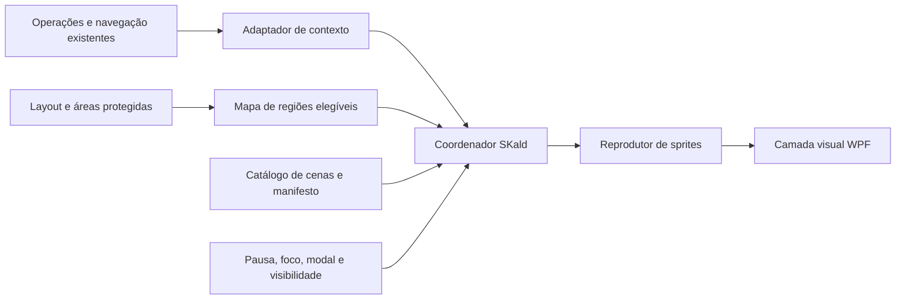

# SKald: plano de integração

## 1. Resultado e escopo

O SKald será uma integração nova no aplicativo desktop WPF existente. Este conjunto contém somente análise e planejamento: nenhum componente, sprite, serviço, preferência ou migration do mascote foi implementado. As zonas e cenas são candidatas; sua viabilidade espacial depende de medições e validação com os assets finais.

| Documento | Conteúdo |
| --- | --- |
| [Mapa do sistema](SKald-mapa-do-sistema.md) | Telas, navegação, abas, janelas, componentes, estados e regiões candidatas/protegidas. |
| [Catálogo de cenas](SKald-catalogo-de-cenas.md) | Cenas por contexto com gatilho, percurso, ações, variações, duração, interrupções, saída e sprites. |
| [Execução e validação](SKald-execucao-e-validacao.md) | Comandos, ferramentas disponíveis, limitações do navegador e matriz de verificação e QA. |

Data da análise: 15/09/2026. Base Git: branch `trabalho-local`, HEAD `634a562`. A análise inclui as alterações locais já existentes, particularmente no editor de notas e na remoção das referências ao mascote anterior; não se limita ao conteúdo do HEAD.

### Fonte do briefing

`docs/SKald-briefing-completo.md` não existia no início desta tarefa. Raul autorizou usar `C:\Users\Raul Janon\Downloads\SKald-briefing-completo.md`, já fornecido na conversa anterior. O original foi preservado; não foi criada uma segunda cópia com aparência de fonte oficial atualizada.

- Tamanho da referência: 95.134 bytes.
- SHA-256: `F4B52509CD10B2B3735A5E6DBDA9169E791A6ACC2F680A5E11441D7FA80B431B`.
- Os itens 26–33 fundamentam a exploração livre; os demais fundamentam personagem, famílias visuais, semântica de eventos e continuidade.
- Os 120 contextos e as 24 sequências/444 posições de quadro do núcleo são propostas. A família de exploração tem produção adicional, ainda não quantificada em desenhos únicos.
- Instruções de implementação, backup, geração ou publicação contidas no briefing não foram executadas como comandos desta tarefa.

## 2. Base confirmada e divergências documentais

| Tema | Evidência atual | Consequência para o plano |
| --- | --- | --- |
| Tecnologia | [UI.csproj](../MacroHelper.UI/MacroHelper.UI.csproj), `net8.0-windows`, WPF, WinForms, WebView2. | Não planejar rotas HTTP, DOM ou CSS para as telas WPF. |
| Organização | Core, Data, Services, UI e Tests; DI em [App.xaml.cs](../MacroHelper.UI/App.xaml.cs). | Geometria e reprodução pertencem à apresentação; persistência e regras do produto permanecem nos serviços existentes. |
| Navegação | [MainViewModel](../MacroHelper.UI/ViewModels/MainViewModel.cs), `PaginaAtiva`/`CurrentView`; ContentControl em MainWindow. | Uma troca de tela invalida destinos e eventos visuais da anterior. |
| Remoção anterior | HEAD exclui controles, recursos, testes e documentos antigos; árvore atual não contém componente SKald. | Não restaurar o mascote antigo. |
| Snapshot de desenvolvimento | CLAUDE cita `b95cb71` e remoção sem commit; HEAD atual é `634a562`. | Registrar a divergência; não atualizar o documento antigo nesta tarefa. |
| Busca rápida | [BuscadorRapidoWindow](../MacroHelper.UI/Views/BuscadorRapidoWindow.xaml.cs) define cinco abas, incluindo Lembretes. | O README ainda descreve quatro; mapear cinco. |
| Notas | RichTextBox + EditorDeMarcacao + DocumentoMarkdown, além da prévia MarkdownVisual. | Proteger edição, seleção, hyperlinks, barra flutuante e popups. A descrição antiga do editor está incompleta. |
| Recursos Windows | Bandeja, hotkeys e monitor do clipboard também existem em `MacroHelper.UI/Windows`. | A divisão real é mais distribuída que a tabela do CLAUDE. |
| Preferências residuais | Settings.settings contém entradas antigas ausentes da classe Settings.cs. | Nomes de API, ditado ou backup não comprovam fluxos ativos. `SugestaoProativaIA` ainda nomeia detecção local de frases; não comprova IA remota. |
| Versão | Version, AssemblyVersion e FileVersion estão explicitamente em 2.3.0. | Valores coincidem, mas a igualdade depende de manutenção. Nenhuma alteração de versão faz parte do plano. |
| Publicação | CLAUDE permite publicação automática; instruções atuais de Raul exigem autorização. | Regras atuais prevalecem. Não publicar, criar commit ou alterar pipeline. |
| Página pessoal | Continua compilada nesta cópia, embora o CLAUDE a exclua conceitualmente do produto entregue. | Não incluir seu conteúdo no catálogo público nem presumir exclusão automática de pacote. |

### Limite do relato sobre WebView2

O CLAUDE registra funcionamento do WebView2 em janela transparente nesta máquina. Isso não prova que um mascote WPF possa aparecer acima de toda a superfície web. A documentação da Microsoft distingue o controle padrão baseado em HwndHost e o WebView2CompositionControl, discutindo o problema de sobreposição conhecido como airspace. O projeto usa o controle padrão; este plano considera a superfície web protegida até ensaio específico. Não propõe atualizar a dependência ou substituir o controle nesta etapa. [Referência Microsoft](https://learn.microsoft.com/en-us/microsoft-edge/webview2/platforms/wpf).

## 3. Decisões propostas para a integração

Estas são propostas técnicas, não funcionalidades existentes nem aprovações de implementação.

1. **Uma instância visível.** Um coordenador pertence ao ciclo de vida da aplicação e concede a exibição a um único hospedeiro. A MainWindow é o primeiro hospedeiro candidato. Janelas flutuantes e popups não recebem cópias automáticas.
2. **Exploração local.** O personagem permanece dentro da área cliente elegível do aplicativo. Não atravessa a área de trabalho, outros programas ou janelas independentes.
3. **Mesa, corpo inteiro e retrato são famílias distintas.** Mudanças de família exigem transição prevista ou ocultação contextual; a mesa não desliza junto com a caminhada.
4. **Entrada do usuário sempre tem prioridade.** Se uma saída animada não puder liberar o espaço imediatamente, ocultar é válido. Um clique não espera o personagem terminar de descer.
5. **Eventos funcionais são explícitos.** Sucesso, erro e processamento acompanham resultados reais. A animação nunca modifica o resultado, o foco, a mensagem ou a duração da operação.
6. **Exploração é decorativa.** Os candidatos a cena são filtrados por contexto, geometria, intensidade de uso e histórico curto antes do sorteio.
7. **Sem espaço significa não executar.** Não reduzir o personagem até ficar ilegível, cobrir texto ou redimensionar controles para completar uma cena.
8. **Sem nova dependência prevista.** PNGs, relógio, transformações e controles podem ser planejados com a estrutura atual. Uma necessidade adicional teria de ser demonstrada antes de introduzir pacote.

## 4. Organização técnica sugerida

| Responsabilidade nova | Local candidato | Limite |
| --- | --- | --- |
| Modelos de cena, estados e seleção determinística | `MacroHelper.Core/Mascote`, somente se permanecerem independentes de WPF. | Não receber entidades completas de notas nem conteúdo de texto; trabalhar com IDs e estados mínimos. |
| Adaptador de eventos/contexto | `MacroHelper.UI`, próximo ao coordenador. | Escutar os caminhos existentes; não copiar regras de validação ou persistência. |
| Mapa espacial | `MacroHelper.UI/Controls/SKald`. | Registrar apenas elementos optantes e obstáculos relevantes do hospedeiro ativo. |
| Coordenador e reprodução | `MacroHelper.UI/Controls/SKald`. | Uma fila curta, uma linha do tempo e descarte explícito. |
| PNGs e manifesto | `MacroHelper.UI/Resources/SKald`. | Recursos futuros, validados antes de reprodução; pose estática de reserva local. |
| Preferências | `Properties.Settings` e Configurações, em futura alteração específica. | Mostrar, pausar e movimento reduzido; não exigir tabela nova no SQLite. |
| Testes futuros | `MacroHelper.Tests`. | Aproveitar relógio controlável, testes de regras e infraestrutura WPF STA existentes. |

Os nomes são candidatos para a implementação futura. Não criar essas classes nesta etapa. Evitar transformar o projeto inteiro em um barramento de eventos apenas para integrar o personagem: um adaptador pequeno com eventos tipados nos pontos necessários é suficiente como ponto de partida.

## 5. Contrato dos eventos

Envelope mínimo proposto: identificador da operação, tipo de acontecimento, tela/janela de origem, versão do contexto e resultado. Não transportar conteúdo de macros, notas, clipboard, caminhos privados ou mensagens técnicas para o catálogo.

| Fluxo existente | Ponto real | Ligação futura e cautela |
| --- | --- | --- |
| Inserir macro | [InsercaoDeMacroService.InserirAsync](../MacroHelper.Services/Dominio/InsercaoDeMacroService.cs), chamado por popup, buscador e MainWindow. | Início, solicitação de variáveis, cancelamento e conclusão local. `false` significa cancelamento do diálogo. `true` ocorre após inserção e log; não confirma que outro aplicativo processou o texto. |
| Salvar macro | [MacroFormViewModel](../MacroHelper.UI/ViewModels/MacroFormViewModel.cs), `IsSaving`, resultado do serviço e evento `Salvo`. | Publicar resultado no retorno conhecido; validação recusada é diferente de falha técnica. |
| Duplicar, favoritar, arquivar, importar/exportar | [MacrosViewModel](../MacroHelper.UI/ViewModels/MacrosViewModel.cs) e MacroService. | Notificar após conclusão efetiva. Fechar seletor de arquivos sem escolher não é erro nem sucesso. |
| Consultar notas | [NotasViewModel.CarregarAsync](../MacroHelper.UI/ViewModels/NotasViewModel.cs). | Distinguir consulta atual concluída, consulta com falha, coleção sem filtro e pesquisa vazia. `IsLoading == false` isoladamente não comprova sucesso. |
| Primeira nota | NotaService retorna a nota criada, mas não publica evento de primeira nota global. | Condicionar a contagem global anterior confirmada e criação persistida. Nunca deduzir a partir de `Notas.Count` filtrado, abertura do formulário ou primeira nota exibida. |
| Salvar nota flutuante | [NotaFlutuanteWindow](../MacroHelper.UI/Views/NotaFlutuanteWindow.xaml.cs), gravação na troca, fechamento e perda de foco. | Evitar comemoração a cada autosalvamento; apenas escrita realmente persistida e contexto ainda elegível. |
| Tarefas e compromissos | TarefaService, CompromissoService e VMs. | Observar resultado real; não transformar marcação de tarefa recorrente em sucesso duplicado para ocorrência antiga e nova. |
| Notificações | [LembreteService](../MacroHelper.Services/Dominio/LembreteService.cs), `LembretesVencidos` e `AvisosDeCompromisso`. | Reação discreta somente se hospedeiro elegível estiver visível; não abrir janela nem reexibir notificação do sistema. |
| Aviso de tela | [ViewModelComMensagem](../MacroHelper.UI/ViewModels/ViewModelComMensagem.cs). | Hoje há Mensagem e MensagemSucesso separados, sem ID da operação. Não analisar frases nem assumir que uma mudança de propriedade é um evento completo e atômico. |
| Navegação/tema | MainViewModel e ThemeService. | Invalidar contexto/layout. Tema escolhido não muda a cor dos sprites arbitrariamente; conferir legibilidade e manter identidade. |

O catálogo não deve acrescentar login, sessão expirada, sincronização, agendamento de macros, execução em lote com pausa/retomada, conquistas, backup ou atualização automática apenas para usar cenas do briefing. Quando um resultado não puder ser observado de forma confiável, manter a cena correspondente desabilitada.

### Concorrência e obsolescência

- Trocar de tela incrementa a versão do contexto. Eventos antigos não viajam para a nova tela.
- Uma conclusão só encerra o processamento da mesma operação. Outra operação ainda em curso não é apagada por esse resultado.
- Salvar uma nota enquanto outra consulta termina não pode disparar "primeira nota" ou "lista vazia" fora de ordem.
- Agrupar sucessos próximos, descartar decoração pendente em erro e rejeitar eventos repetidos identificáveis.
- A fila visual nunca bloqueia `await` do serviço. Falha do recurso do mascote não pode impedir salvar, concluir ou navegar.

## 6. Geometria e percurso

### Coordenadas e regiões

Usar um referencial por hospedeiro em unidades independentes de dispositivo do WPF. Converter a geometria dos elementos para a camada do personagem; não misturar pixels físicos da tela, coordenadas de outra Window e coordenadas de ScrollViewer. `TransformToVisual` fornece uma transformação entre visuais relacionados, apropriada a essa conversão dentro da mesma árvore. [Referência Microsoft](https://learn.microsoft.com/en-us/dotnet/api/system.windows.media.visual.transformtovisual?view=windowsdesktop-8.0).

Cada apoio candidato declara: identificador, tipo, lados admitidos, ações aceitas, largura útil, folga superior/lateral, retângulo visível e motivo de inelegibilidade. Nomear o controle não basta: consultar tamanho efetivo, ancestrais que recortam, rolagem, sobreposição e estado atual.

Não registrar todos os Buttons indiscriminadamente. Linhas inteiras de notas são botões; células vazias da agenda também executam ações. Seus interiores continuam protegidos. Cantos arredondados, barra de título, bordas de redimensionamento, barra de rolagem e sombras não são chão.

### Movimento válido

1. Calcular o envelope completo dos quadros da ação, incluindo capa, mãos, objetos e partículas, relativo à âncora.
2. Escolher entrada, pontos de passagem e destino dentro da região visível.
3. Expandir os obstáculos pela folga/envelope necessário. Verificar o volume ocupado ao longo de cada segmento; para saltos, incluir todo o arco e a acomodação da aterrissagem.
4. Revalidar antes de arrancar, saltar, sentar e deitar. Um destino válido ao sortear pode desaparecer antes da chegada.
5. Sem rota: tentar outro candidato elegível ou encerrar. Sem retirada segura após mudança: ocultar brevemente e descartar a cena.

Um grafo pequeno de corredores e apoios é suficiente para o primeiro protótipo; simulação física completa não é necessária. O salto tem altura máxima calibrada pelos sprites e espaços medidos, não por uma coordenada inventada no documento. Deitar exige comprimento maior que sentar e saída desenhada até ficar em pé.

Atualizar o mapa em navegação, rolagem, redimensionamento, alteração de coleção, expansão, mudança de modo da agenda, abertura de formulário/popup/menu, mudança de DPI e mudança de visibilidade. Agrupar invalidações e recalcular após o layout se estabilizar. Não varrer a árvore inteira em cada quadro; o movimento do próprio mascote não deve provocar um ciclo de recálculo do mapa.

### Captura de entrada

A camada decorativa deverá ser excluída de hit testing e foco. Em WPF, `IsHitTestVisible=false` no contêiner impede a participação dele e de seus descendentes no teste de entrada. Isso não resolve obstrução visual: os controles também precisam permanecer descobertos. Nunca aplicar essa propriedade ao contêiner do produto inteiro. [Referência Microsoft](https://learn.microsoft.com/en-us/dotnet/api/system.windows.uielement.ishittestvisible?view=windowsdesktop-10.0).

Não invocar comandos, `RaiseEvent`, UI Automation, SendInput, clique, seleção, foco ou movimento do mouse para representar um toque do mascote. O efeito acontece na camada dele, sem mudar tamanho, posição, padding ou estado do botão. Não criar botões transparentes sobre apoios. Pausa e ocultação ficam em controles reais de configuração, separados do percurso.

## 7. Estados e reprodução

| Estado proposto | Entrada | Saída |
| --- | --- | --- |
| Oculto | Preferência desligada, janela escondida, ausência de espaço ou exclusão de contexto. | Reavaliar contexto quando elegível; não reproduzir a fila antiga. |
| Estático | Movimento reduzido, pausa explícita ou recurso animado indisponível. | Retomar somente por mudança da condição, respeitando preferência. |
| Repouso | Hospedeiro disponível, pose válida. | Cena decorativa elegível ou evento funcional. |
| Exploração | Cena, trajeto e sprites válidos. | Saída da cena, interrupção, evento prioritário ou ocultação de contingência. |
| Reação funcional | Resultado atual observado e espaço apropriado. | Pose atual coerente; não limpar a mensagem funcional do produto. |
| Suspenso | Modal, edição intensa, seleção ou popup que inviabiliza a região. | Revalidar antes de nova cena; nenhuma caminhada automática ao fechar o modal. |

Na proposta inicial, janela desativada também suspende exploração. Isso preserva o uso de outra aplicação enquanto MacroHelper continua aberto em segundo plano. O alcance dessa política poderá ser revisto na validação, sem alterar o requisito de não roubar foco.

- Base de reprodução: 8 fps para troca de desenhos. Deslocamento espacial e troca de quadros são controles separados; calibrar velocidade pela passada real.
- Intervalo decorativo inicial: 45–90 segundos após a cena terminar, quando houver ociosidade elegível. Cenas raras: pelo menos cinco minutos entre elas. Não acumular crédito enquanto oculto.
- Saudação: uma por sessão elegível da aplicação, sem recriar saudação por mudança de View. Não existe sessão autenticada neste produto.
- Sucessos genéricos: referência de seis segundos entre comemorações, sem atrasar o resultado. Operação que termina rapidamente dispensa loop de processamento.
- Cancelamento urgente: respeitar o usuário imediatamente, mesmo quando isso exigir ocultação em vez de concluir uma saída animada.
- Remoção do hospedeiro encerra relógio, inscrições de eventos e referências aos elementos. Reconstrução não duplica instância nem timer.

### Assets e legibilidade

Produzir primeiro a folha de modelo, poses de ligação e ciclos curtos completos. PNG transparente por quadro é a proposta principal. APNG/GIF servem de prévia opcional, sem presumir suporte animado nativo. WebP não é necessário.

Mesa: grade lógica de 128 × 128, entrega inicial 256 × 256. Corpo inteiro: referência própria de 64 × 64, entrega inicial 128 × 128. Ícones: versões desenhadas para 16, 24, 32, 48 e 64. São dimensões de arte propostas, não tamanho aprovado no layout.

O manifesto deverá registrar ordem, duração por quadro, família, âncora, pose inicial/final, pontos de interrupção desenhados, envelope máximo, variante estática e regras de repetição. Não centralizar nem recortar cada quadro individualmente. Não espelhar acessórios assimétricos sem decisão de arte consistente.

Para preservar a grade, avaliar `RenderOptions.BitmapScalingMode=NearestNeighbor`; a enumeração WPF oferece esse modo de ampliação. Isso não elimina a necessidade de verificar escalas de DPI fracionárias e alinhamento físico dos pixels. [Referência Microsoft](https://learn.microsoft.com/en-us/dotnet/api/system.windows.media.bitmapscalingmode?view=windowsdesktop-8.0).

## 8. Sequência de trabalho futura

| Etapa | Entrega | Condição para avançar |
| --- | --- | --- |
| 0. Confirmar base | Revisar estes documentos, origem do briefing e estado local; registrar um ponto de restauração por mecanismo autorizado antes de implementar. | Preservação das alterações preexistentes e escopo decidido. Este plano não cria commit. |
| 1. Medir a interface | Inspeção WPF com dados sintéticos: tamanhos padrão e mínimo, claro/escuro, DPI e estados abertos. | Pelo menos uma zona e uma retirada confirmadas em cada tela priorizada. |
| 2. Produzir o mínimo visual | Modelo, repouso, virada, caminhada nos dois sentidos, aceno, leitura e saídas; pose estática. | Identidade, continuidade, transparência e envelope verificados. |
| 3. Prototipar presença | Um hospedeiro, pausa/ocultação, um percurso de entrada/leitura/saída em tela de baixo conflito. | Zero captura de entrada; nenhum acesso ao texto do usuário pelo planejador; descarte completo. |
| 4. Ensaiar apoios | Pensar, toque lateral, salto, pouso, sentar, deitar, levantar e retirada. | Geometria e teclado/mouse validados; ausência de comando disparado. |
| 5. Integrar reações | Retornos reais de macro/nota e notificações elegíveis; família de mesa. | Sem sucesso falso, sem espera artificial, sem evento antigo em tela nova. |
| 6. Expandir variedade | Habilitar as cenas do catálogo por tela e perfil de espaço; calibrar pesos e pausas. | Cada cena passa pela mesma revisão; catálogo grande não obriga habilitar todas. |

O primeiro ensaio pode usar o Início, mas a seleção final depende da medição. Nenhum botão já foi aprovado como plataforma. Se nenhuma região comportar o personagem no tamanho mínimo da janela, essa configuração recebe apenas pose estática reservada ou exibição desativada, sem redesenho silencioso do produto.

## 9. Pendências e critérios de conclusão

- Todas as telas do inventário foram analisadas no código; nenhuma foi declarada visualmente aprovada por essa leitura.
- Build e suíte não foram executados nesta alteração documental. Não há conclusão atual sobre aprovação da aplicação.
- A documentação de execução registra ambiente disponível, recursos de teste já existentes e os limites da ferramenta de navegador frente ao WPF.
- Permanecem pendentes medição de áreas, ensaio com dados sintéticos, foco e teclado, sobreposição WebView2, desempenho, DPI, mudança de monitor e animações finais.
- Entrega desta etapa: os quatro documentos, revisados por consistência, rastreabilidade, completude de cenas e preservação dos arquivos existentes.

Critério de futura aprovação de cada cena: gatilho verdadeiro ou explicitamente decorativo; percurso inteiro validado; rosto/objetos consistentes; textos descobertos; nenhum comando, foco ou seleção alterado; interrupção imediata disponível; ausência de fila/timer residual; fallback testado. Uma cena sem essas evidências permanece candidata.

### Verificação da entrega documental

- Quatro documentos novos em `docs`, com links locais conferidos e sem destinos inexistentes.
- Catálogo com 60 IDs únicos, C01–C60, sem lacunas. Todas as fichas contêm local/elemento, gatilho, percurso, ações, variações, duração, interrupções, saída e sprites necessários.
- Revisão cruzada do inventário e do catálogo: componentes usam IDs UI01–UI10, distintos das cenas; T00–T18 identificam superfícies e Z01–Z07 os tipos de zona.
- Comparação SHA-256 de 186 arquivos preexistentes de código, configuração e documentação: nenhum conteúdo alterado. A comparação exclui `.git`, `bin`, `obj` e os documentos novos de `docs`.
- Essas verificações comprovam consistência documental e preservação dos arquivos, sem substituir os testes funcionais e visuais pendentes.
